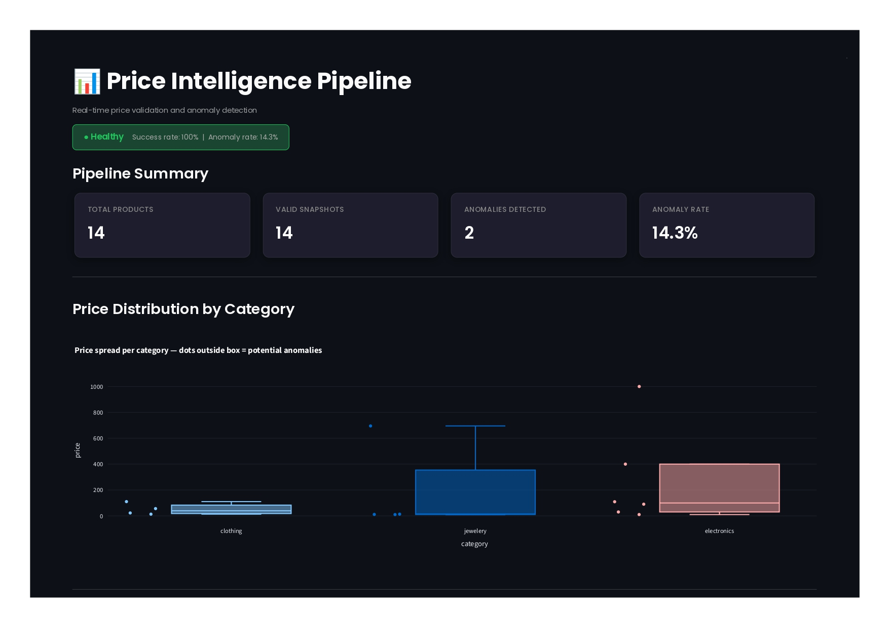

# E-Commerce Data Intelligence Pipeline

## Live Dashboard

## Overview
I built a real-time price validation and anomaly detection pipeline. It fetches product data asynchronously from an e-commerce API, validates every record using Pydantic data contracts, and flags price anomalies using IQR-based detection. During development I discovered that Z-score detection fails on small, skewed price datasets due to the masking effect — so I switched to IQR which is robust to outliers. The live API has insufficient products per category to trigger anomalies, which I documented as a known limitation. The system correctly detects anomalies on controlled test data with sufficient sample sizes.
this pipeline has two core components:

**Order Validation Pipeline**
Ingests customer orders from an API, validates every record against 
a strict Pydantic data contract, and produces two outputs — a clean 
orders report ready for downstream processing, and a rejected orders 
report with precise error details for each malformed record.

**Price Intelligence Pipeline**
A two-layer system that fetches product data asynchronously from 
multiple endpoints, validates every product at ingestion, then runs 
IQR-based anomaly detection to flag products whose prices deviate 
significantly from their category norm. Designed to catch pricing 
errors before they reach dashboards or influence business decisions.

## Known Limitations
- Z-score anomaly detection requires sufficient products per category (recommended: 10+)
- With fewer than 6 products per category, the masking effect may hide genuine anomalies
- The Fake Store API has 4-6 products per category — mock data is used to demonstrate 
  anomaly detection behaviour
- Production deployment should use a dataset with 20+ products per category minimum
- it is therefore better to use IQR as it is resistant to oultliers this is because IQR uses the middle 50% of prices to define normal range, so extreme prices  don't inflate the way they inflate the standard deviation
